# Проект Shopping List

## Краткое описание

На данный момент в приложении реализованы html 
страницы регистрации и авторизации с поддержкой валидации. 

Нажатие на кнопку submit напрямую отправляет запрос на backend 
сервер, то бишь реализована какая никакая связь между frontend и 
backend. Сами запросы работают с базой данных, добавляя туда новые данные или
проверяя существующие там данные на наличие конкретных.

Интерфейс реализован с помощью tailwindcss + html + javascript, 
бэкенд реализован с помощью Node.js

## Реализация функционала
В ходе создания приложения пришлось познакомиться с множеством разных аспектов работы с вебом, 
ибо все "кирпичики", из которых сложилось приложение, были изучены и реализованы с полного нуля.

Стили страницы регистрации и авторизации были реализованы не с помощью легковесной
библиотеки стилей materialize, как в минилабе, а с помощью довольно мощной и популярной библиотеки
стилей tailwindcss. В то же время, и сам html файл был создан с полного нуля с целью более глубокого изучения
верстки. То бишь, не был использован шаблон, показанный в минилабе1.

Бэкенд также был реализован с нуля с помощью Node.js, а не Python, как в минилабе2. 
Никакие изначально данные шаблоны не были использованы, то бишь весь материал изучался с нуля.
Потребовалось познакомиться с типами запросов и их отличиями, с CORS для установления связи между серверами фронта и бэка, а 
также с базовой обработкой данных через JSON.parse() и JSON.stringify(). Изучены также базовые способы взаимодействия
с данными на бэке, с бд, с routes, controllers, middlewares, а также с configs.

Фронтэнд также реализован с нуля, то бишь потребовалось самому изучить способы работы с DOM, 
саму его структуру, способы отправки запросов с бэка на фронт, разобраться с Promise.

## Функционал 
На данный момент связь фронта и бэка ограничивается передачей данных и проверкой на то, что эта передача вообще
работает: в случае с формой регистрации данные добавляются в бд, а в случае с формой авторизации проводится проверка
пристуствие переданных данных в бд. В то же время, присутствует еше и валидация входящих данных.

### Форма авторизации
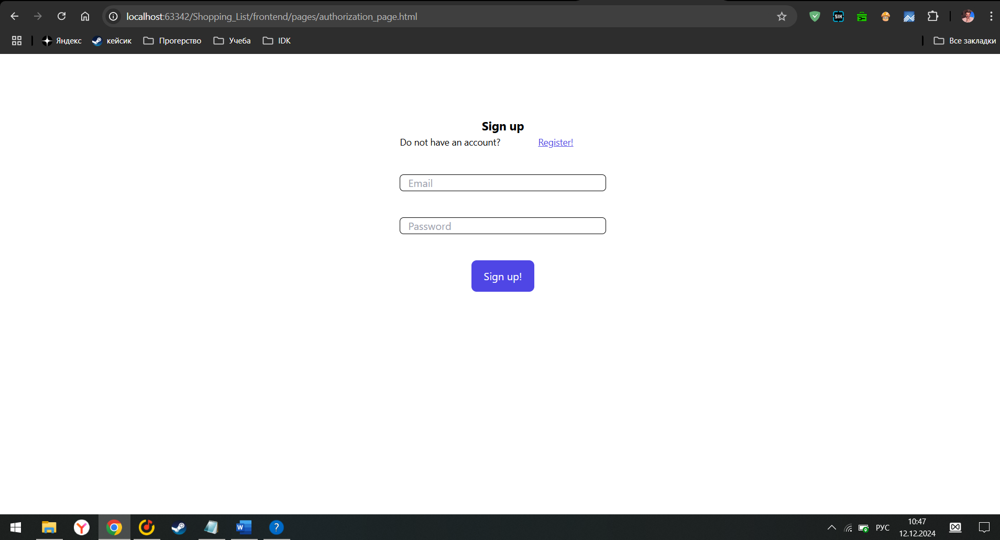
### Форма регистрации
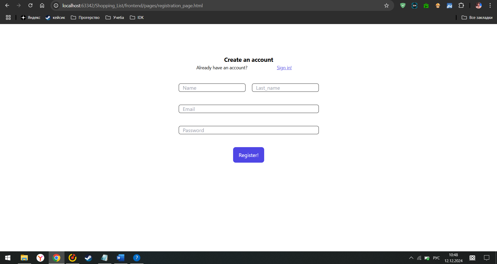
### Голый index.html
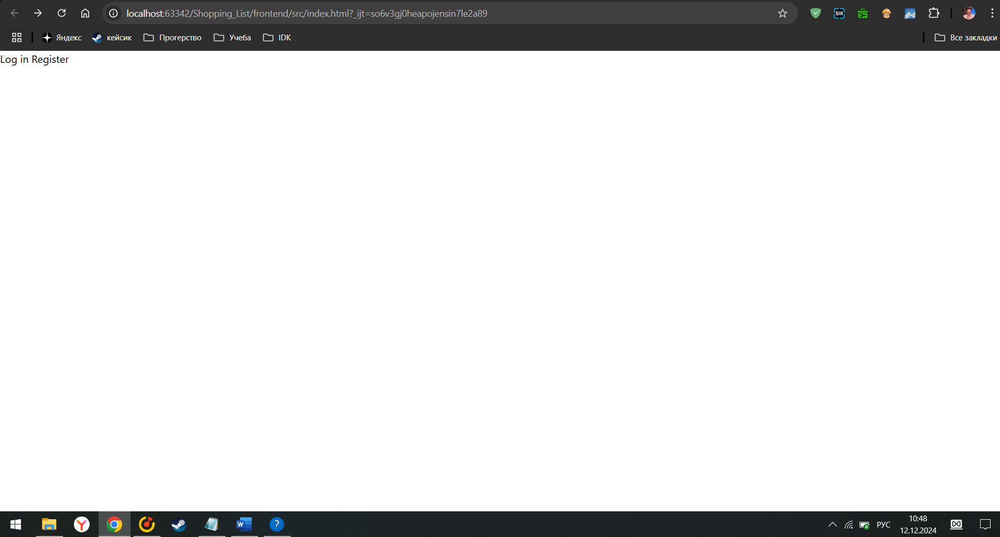
### Демонстрация передачи данных на бэк с фронта(регистрация)
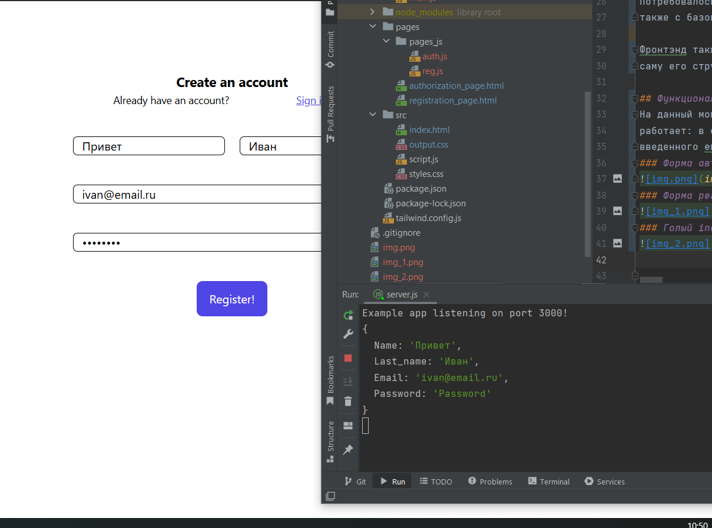
### Демонстрация валидации данных при передаче данных на бэк с фронта(авторизация)
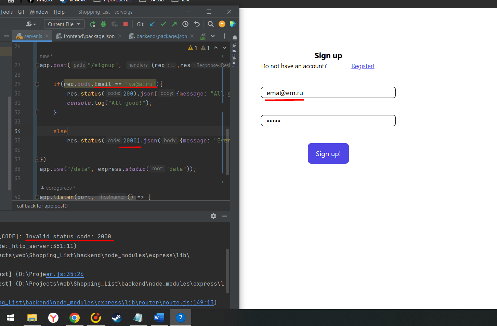
### Демонстрация изначальной валидации данных на странице авторизации
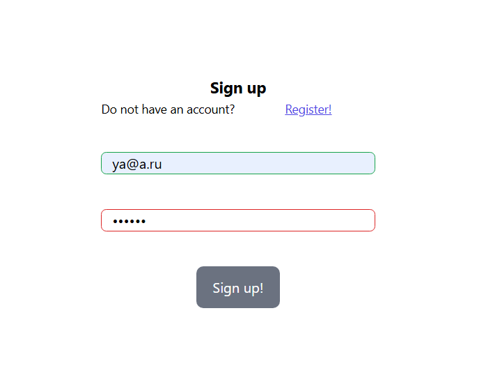
### Демонстрация изначальной валидации данных на странице регистрации
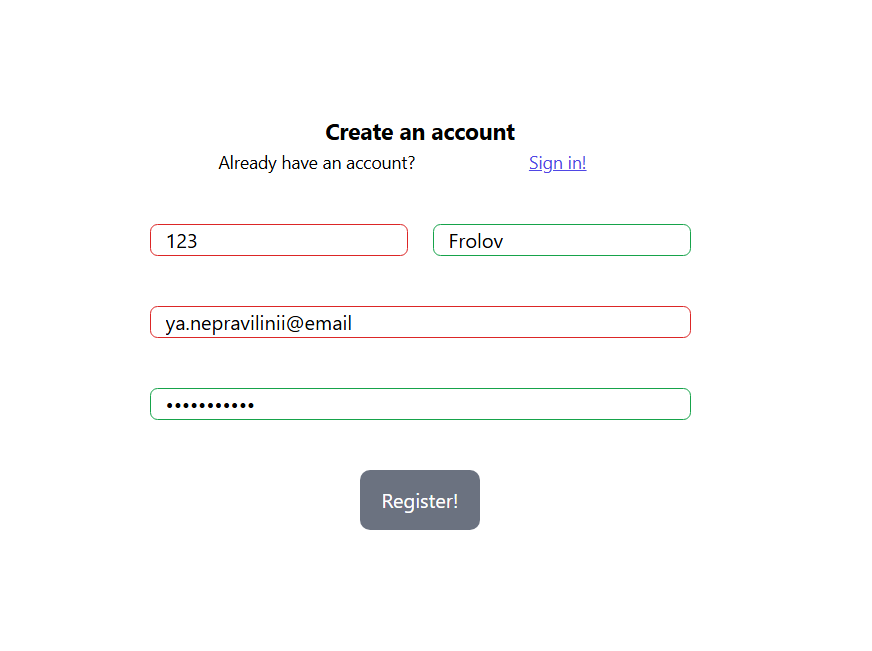
### Демонстрация корректно заполненной формы
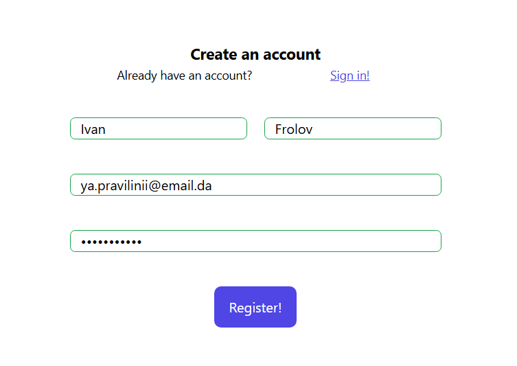
### Демонстрация добавления данных при регистрации в базу данных
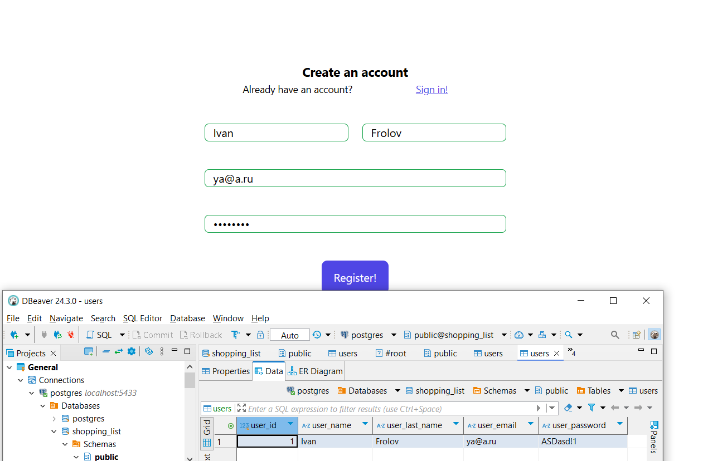
### Демонстрация попытки авторизироваться с некорректными данными
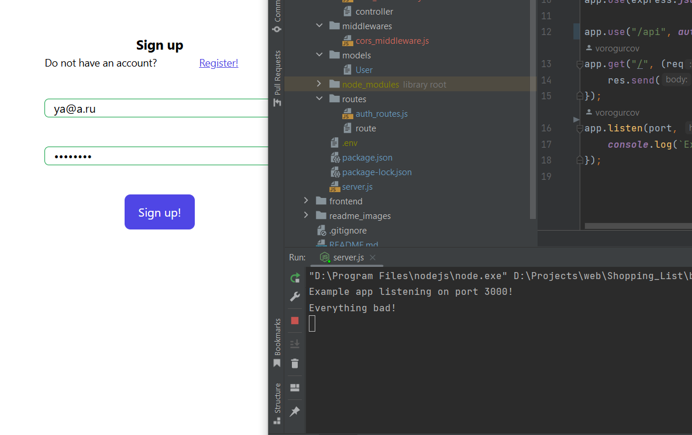
### Демонстрация попытки авторизироваться с корректными данными
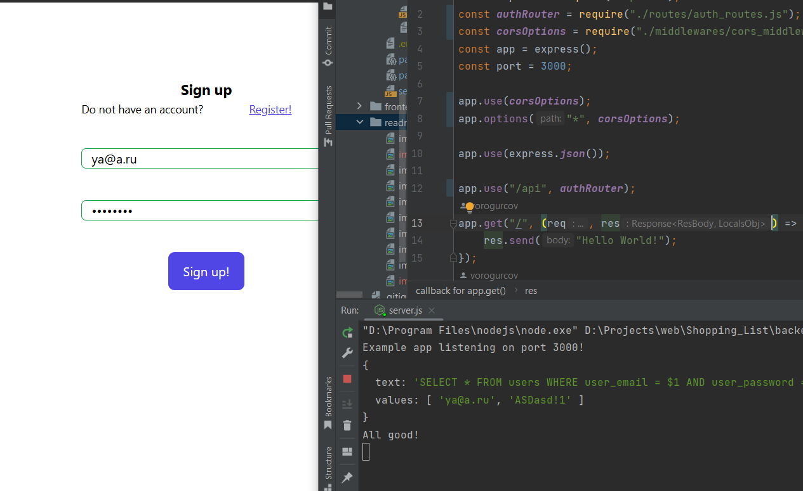

### Потенциальные улучшения
На данный момент не реализовано очень много функционала и в первую очередь это связано с тем, что мы с Евгением Диденко, с 
которым мы в группе, стараемся досконально разобраться в том, что пишем и зачем.

Потенциально же можно реализовать следующее:
* Достилизовать index.html и сделать функционал самого приложения

### Напоследок
Мы постараемся сделать доделать и доусложнять данный сайт по мере наших возможностей к моменту выступления на зачете. Пока не очень понятно, будет ли возможность его доделывать и досдавать в следующем семестре,
раз уж было так мало времени для реализации.
